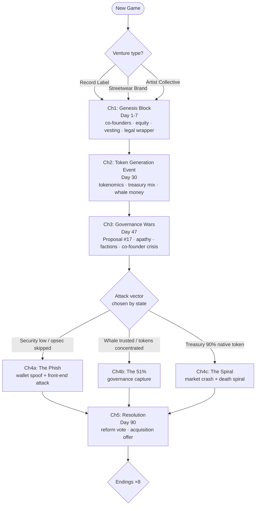

# Story Structure

Five chapters over 90 in-game days. The spine is linear (chapters always occur); the **branches live inside chapters** and in the accumulated state that determines Chapter 4's attack vector and the ending. This is the "braided rope" structure: local branches that re-merge, plus persistent stat/flag consequences — cheap to write, feels reactive.

## Chapter summaries

| Ch | Title | Day | Dramatic question | Primary lessons |
|----|-------|-----|-------------------|-----------------|
| 1 | [[Chapter 1 - Genesis Block]] | 1–7 | Who do you build with, and on what terms? | [[The Equal Split Trap]], [[Vesting and Dead Equity]], [[The Partnership Trap]] |
| 2 | [[Chapter 2 - Token Generation Event]] | 30 | Whose money do you take? | [[Treasury Death Spiral]], [[Predatory Recoupment]], [[The Overfunding Paradox]] |
| 3 | [[Chapter 3 - Governance Wars]] | 47 | Who actually rules — and who's quietly leaving? | [[Voter Apathy and Delegation]], [[Burnout and Identity Fusion]] |
| 4 | [[Chapter 4 - The Attack]] | 60 | Can the thing you built survive contact with an adversary? | [[Governance Capture]], [[Flash Loans and Time-locks]], [[Verify the Hex]], [[Ice Phishing]], [[Credential Hygiene]] |
| 5 | [[Chapter 5 - Resolution]] | 90 | What was all this *for*? | synthesis + [[Greenwashing Trap]] (optional beat) |

## Branch rules

- **Venture type** (Label / Streetwear / Collective) flavors scenes and swaps one lesson: Label → [[Predatory Recoupment]], Streetwear → [[Chargeback Death Spiral]], Collective → [[The Overfunding Paradox]].
- **Chapter 4 vector** is *earned*, not chosen: the game picks the attack you are most vulnerable to, so consequences trace back to earlier shortcuts (Pillar P1).
- **Relationship gates:** Spectre warns you pre-attack only if `spectre >= 60`. Vera unlocks the compromise path in Ch3 if `vera >= 40`. Maya's Ch3 burnout crisis softens if `maya >= 50` *and* player Burnout < 60.
- **Endings** are computed from stats + flags — see [[Endings Overview]].

## Pacing model (per Vimi outline method)

Each chapter note contains **scene cards**: `goal / conflict / choice / consequence / lesson`. A scene earns its place only if it changes a stat, a relationship, or a flag. Target: 8–12 scene cards per chapter, ~20–30 min per playthrough, 5 playthroughs to see everything.
